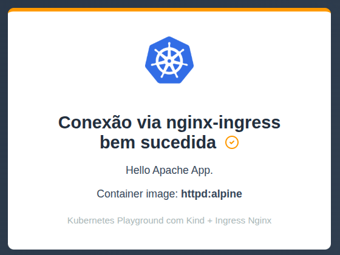
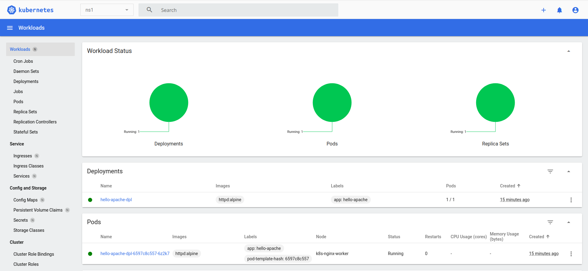

# k8s-kind-nginx-playground

K8S Playground usando Kind com Ingress Nginx.

## Descrição

Este projeto fornece um ambiente completo de desenvolvimento e testes para Kubernetes utilizando o Kind (Kubernetes IN Docker) e o Ingress Nginx. Inclui:

- **Container Registry**: Harbor para gerenciamento de imagens Docker
- **Banco de Dados**: PostgreSQL com interface pgAdmin
- **Aplicação de Exemplo**: API FastAPI em Python conectando ao PostgreSQL
- **Dashboard**: Kubernetes Dashboard para monitoramento
- **Aplicação Web**: Hello Apache App para demonstração
- **Automação**: Scripts de provisionamento e configuração

O ambiente é ideal para desenvolvedores que precisam de um playground completo para testar aplicações Kubernetes, incluindo registry de containers, banco de dados e aplicações de exemplo.

## Pré-requisitos

- [Vagrant](https://www.vagrantup.com/)
- [VirtualBox](https://www.virtualbox.org/) (ou outro provider compatível com Vagrant)

## Estrutura do Projeto

```
.
├── apache-hello/
│   ├── hello-apache-app.png        # Exemplo visual da aplicação Apache
│   ├── hello-apache-cm.yaml        # ConfigMap para o Apache
│   ├── hello-apache-dpl.yaml       # Deployment do Apache
│   ├── hello-apache-ing.yaml       # Ingress para expor o serviço Apache
│   └── hello-apache-svc.yaml       # Service para o Apache
├── harbor/
│   ├── values.yaml                  # Configuração Helm do Harbor sem HTTPS
│   ├── docker-daemon-config.md      # Instruções para configurar Docker daemon
│   └── README.md                    # Documentação de acesso ao Harbor
├── ingress-nginx/
│   └── ingress.yaml                # Configuração do Ingress Nginx
├── kubernetes-dashboard/
│   ├── kube-dashboard.png          # Exemplo visual do Dashboard
│   ├── dash-ing.yaml               # Ingress para o Dashboard
│   └── dash-admin.yaml             # ServiceAccount e permissões para o Dashboard
├── pgadmin/
│   ├── README.md                   # Documentação de acesso ao pgAdmin
│   └── pgadmin-ing.yaml            # Ingress para o pgAdmin
├── projects/
│   └── ecom-python/
│       ├── main.py                  # API FastAPI de produtos
│       ├── requirements.txt         # Dependências Python
│       ├── Dockerfile               # Dockerfile da API
│       ├── README.md                # Instruções da API
│       └── infra/
│           ├── deployment.yaml      # Deployment do app no K8s
│           ├── ingress.yaml         # Ingress do app
│           ├── namespace.yaml       # Namespace ecom-python
│           └── service.yaml         # Service do app
├── bootstrap.sh                    # Script de bootstrap para provisionamento
├── Vagrantfile                     # Arquivo de configuração do Vagrant
├── README.md                       # Este arquivo
├── roadmap/                         # Diretório para roadmap do projeto
└── command-utils/
    └── debug.sh                     # Script utilitário
```

## Variáveis de Ambiente para Personalização da VM

| Variável             | Valor Esperado | Efeito                                                                 |
|----------------------|:--------------:|------------------------------------------------------------------------|
| WITH_GUI             | "1" ou vazio   | Se "1", instala interface gráfica (Xubuntu Core + LightDM) na VM.      |
| INSTALL_BROWSER      | "1" ou vazio   | Se "1", instala o navegador Firefox na VM.                             |
| SETUP_KIND_K8S       | "1" ou vazio   | Se "1", copia os arquivos do projeto e executa o script bootstrap.sh.  |

## Como usar

1. **Clone o repositório:**
   ```sh
   git clone git@github.com:joseafilho/k8s-kind-nginx-playground.git
   cd k8s-kind-nginx-playground
   ```

2. **Suba o ambiente com Vagrant:**
   
   - **Com interface gráfica:**
     ```sh
     WITH_GUI=1 INSTALL_BROWSER=1 vagrant up
     ```
     Ao final da instalação, execute:
     ```sh
     SETUP_KIND_K8S=1 vagrant reload --provision
     ```
   
   - **Somente terminal (sem GUI):**
     ```sh
     SETUP_KIND_K8S=1 vagrant up
     ```
     Acesso a máquina virtual via ssh:
     ```sh
     vagrant ssh
     ```
   
   - *Com interface gráfica(Rodando somente um comando) - Em Teste:*
     ```sh
     ./create-enviroment-gui.sh
     ```

## Validação de Funcionamento

- **Com interface gráfica (GUI):**
  1. Após acessar a máquina virtual via VirtualBox, abra o navegador Firefox instalado na VM.
     - Usuário padrão da VM: **vagrant**
     - Senha padrão da VM: **vagrant**
  2. **Hello Apache App**: Acesse http://domain.local:30001/hello-apache/
     - Você deve ver a página de boas-vindas do Hello Apache App
     - 
  3. **Kubernetes Dashboard**: Acesse https://domain.local:30002/
     - Token de acesso: `/home/vagrant/playground/dash-token` na VM
     - 
  4. **Harbor Container Registry**: Acesse http://core.harbor.domain:30001/
     - Usuário: `admin`, Senha: `Harbor12345`
  5. **pgAdmin**: Acesse http://pgadmin.local:30001/
     - Email: `admin@admin.com`, Senha: `admin-user`
  6. **API FastAPI**: Acesse http://ecom-python.local:30001/
     - API de produtos conectando ao PostgreSQL

- **Somente terminal (sem GUI):**
  1. Acesse a VM com `vagrant ssh`
  2. **Teste Hello Apache App**:
     ```sh
     curl -v http://domain.local:30001/hello-apache/
     ```
  3. **Teste Harbor Registry**:
     ```sh
     docker login core.harbor.domain:30001
     docker pull hello-world
     docker tag hello-world core.harbor.domain:30001/library/hello-world:latest
     docker push core.harbor.domain:30001/library/hello-world:latest
     ```
  4. **Teste API FastAPI**:
     ```sh
     curl http://ecom-python.local:30001/products
     ```

## Observações

- Certifique-se de que as portas necessárias estejam liberadas no seu ambiente.
- O Ingress Nginx será exposto conforme definido no arquivo `ingress-nginx/ingress.yaml`.
- **Harbor Registry**: Configure o Docker daemon para usar Harbor como registry inseguro (veja `harbor/README.md`).
- **PostgreSQL**: O banco de dados é persistente e mantém os dados entre reinicializações.
- **API FastAPI**: A aplicação de exemplo demonstra conexão com PostgreSQL e deploy no Kubernetes.
- Para acessar as aplicações, utilize os endereços configurados no Ingress após a criação dos recursos.

## Referências

- [Kind - Kubernetes IN Docker](https://kind.sigs.k8s.io/)
- [Ingress Nginx Controller](https://kubernetes.github.io/ingress-nginx/)
- Projeto inspirado em: [README.md original de mascosta](https://github.com/mascosta/docs/blob/main/kind-ingress-nginx/README.md)
